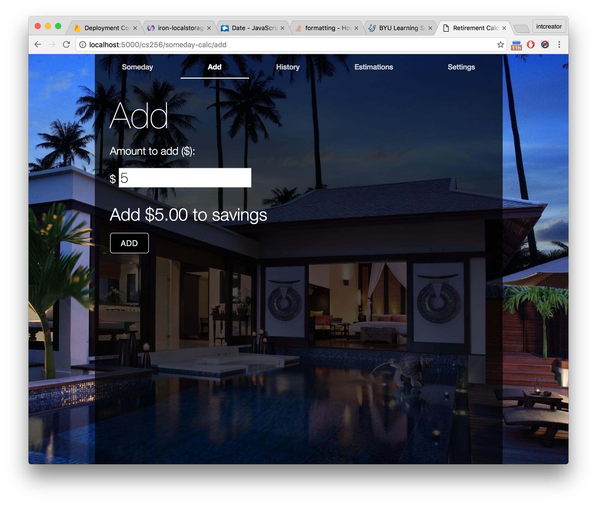
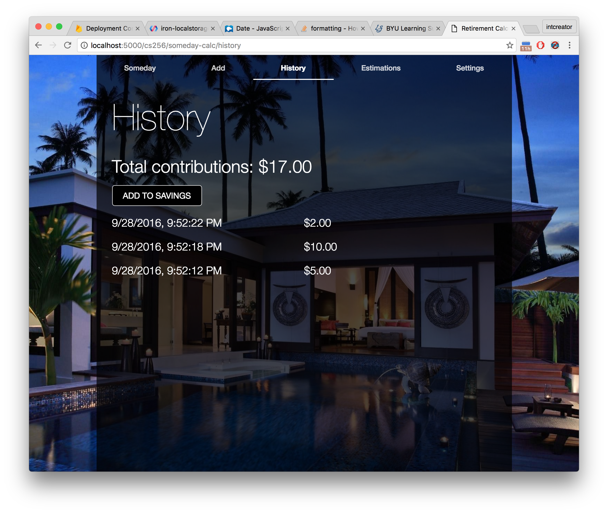
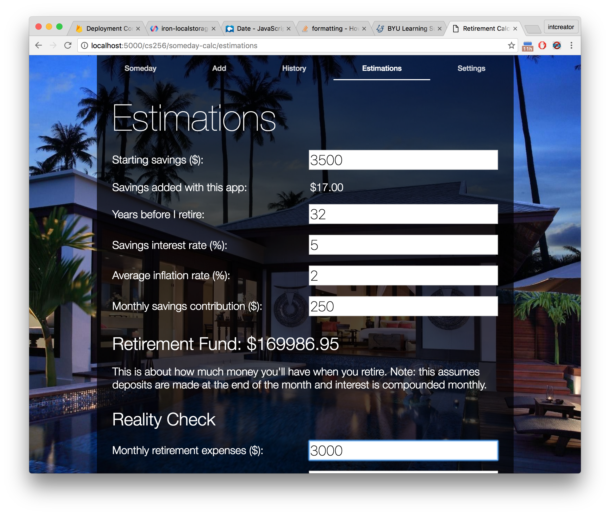
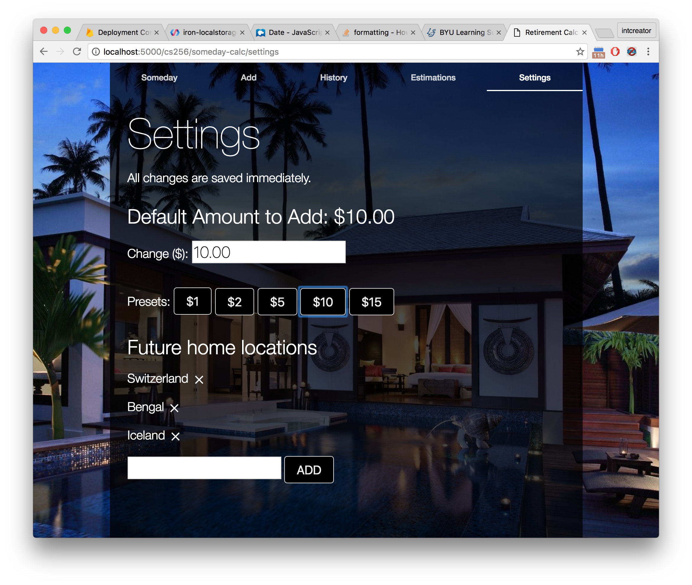

# Someday Calculator

Use the [Someday Calculator online](https://intcreator.com/cs256/someday-calc/).  This project was built for Brett Manning.

## Overview

This is a motivational retirement planner/calculator that ideally would be connected to Brett's checking and savings accounts.  This way he could add money from the app, track his saving progress, and make predictions for future needs and goals.

## Add Page

This page is possibly the most important to Brett because he finds it hard to actually put away the money needed to fund his own retirement.  If he has money now, he likes to spend it on improving his current lifestyle.  If he doesn't have a lot of money, saving for the future isn't a priority.  I hope to overcome this obstacle in part by prompting Brett to contribute small amounts of money at a time.

## History Page

The history page will give Brett an insight to previous contributions he has made.  He'll be able to verify and track his progress and feel good about the ever growing total at the top of the page.

## Estimations Page

My calculations handle starting savings and monthly addition growth separately under the hood (Brett will likely be confused by implementation details).  Brett enters in his predictions and gets two important numbers out: the total amount of money he'll have when he retires and an estimate of leftover money for monthly expenses while he's in retirement.

## Settings Page

The settings page allows Brett to customize the app even further, perhaps according to changing attitudes about the rate at which he should save money or new inspiration for retirement getaways.  What motivated him most was the idea of a home in an exotic place that he would be able to own only if he saved money, so I gave him the opportunity to add his own locations.  The idea here is that he would then see these ideal homes and be motivated to make a contribution to his savings while using the app.

## Visual Design

The original background was all black but based on Brett's feedback and I changed it so the landing page photo persists on all pages.  This will help prevent the app from feeling bland.

I used large fonts for important information like titles of pages (which indicate their function) and the results of calculations or actions.

## Interaction Design

I split the functionality of the app into several tabs.  Brett liked the tabbed layouts I drew in my sketches so I thought it would be a good fit.  Each tab has just one purpose and may link to others for convenience and to teach Brett how to navigate the app.

The estimations tab has several clearly labeled fields in order with short and understandable instructions for filling them.  Calculations are performed immediately so Brett doesn't have to search for a calculate button or wait for a page to load.  The results are displayed clearly in a larger font and change based on user input, which attracts attention.

The settings are also saved immediately.  I added a note and appropriate feedback when changes are made because Brett said that approach was confusing at first (most apps require that the user click a save button).

## Extending the Assignment

I implemented the estimations tab to fulfill the requirements of the assignment, but the rest of the app follows the idea and sketch that Brett liked best, which was a browser extension that replaced his home page with a picture of his dream retirement home and an "Add to savings" button.  My implementation is close to the functionality Brett would need to actually use it—all that is required for it to work in the real world is persistent storage and communication with banking services.  If Brett sets this app as the default new tab page, he'll have something close to the functionality of the browser plugin idea.
