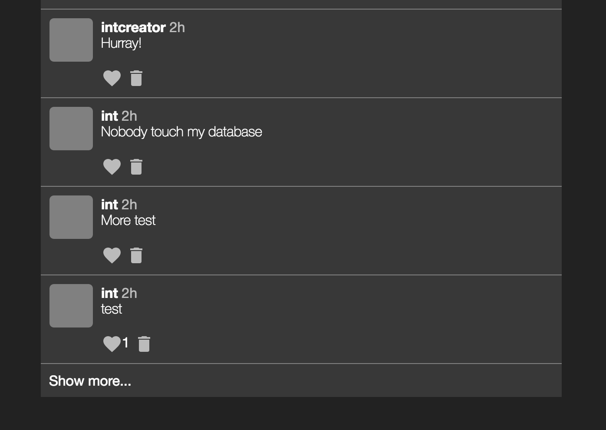
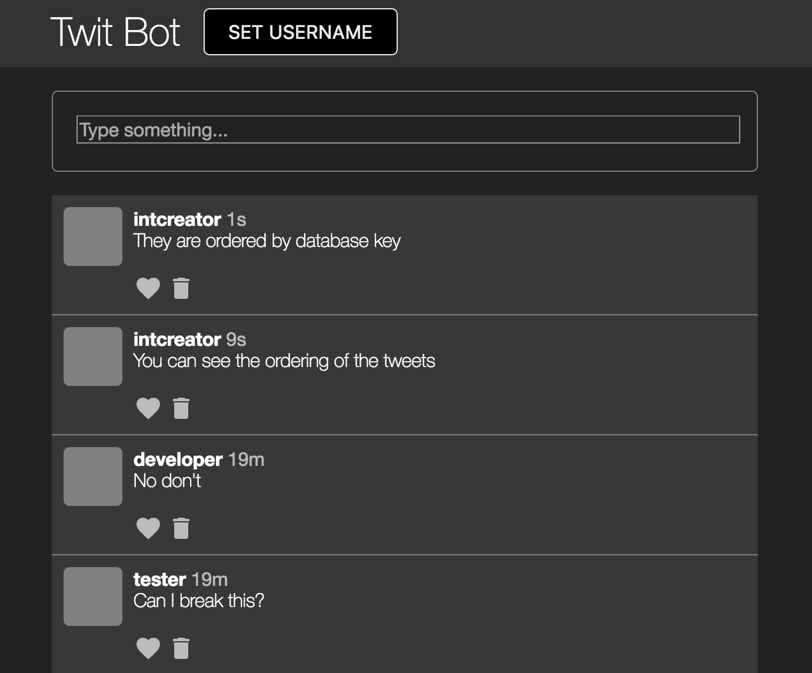
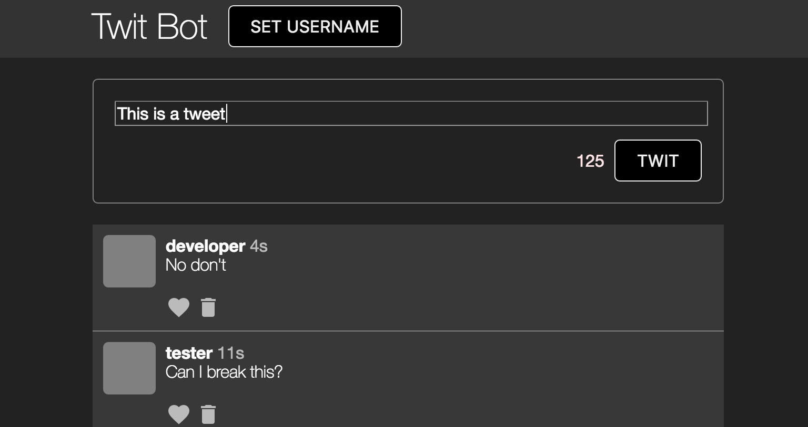
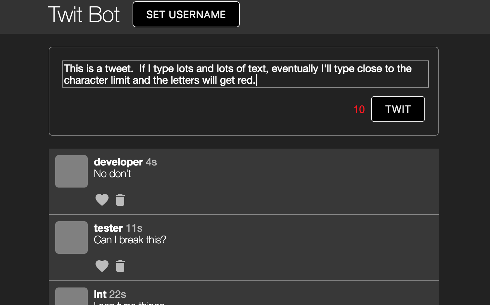
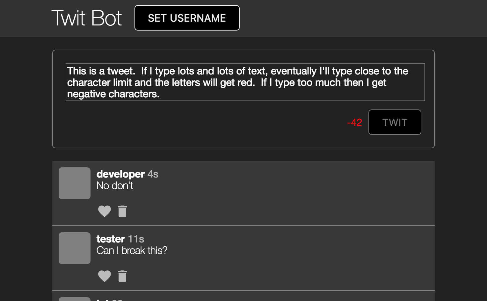
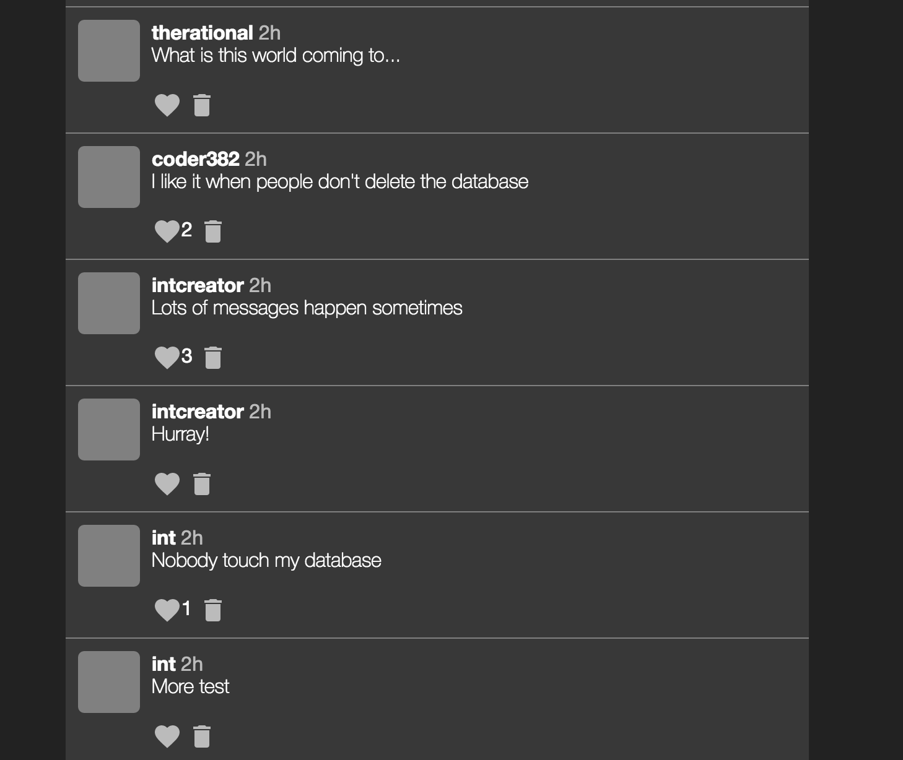

# Twit Bot

Use the [Twit Bot online](https://intcreator.com/cs256/twit-bot/).

Note: because people were doing bad things like writing scripts to delete the database whenever someone posted to it, this bot is using a different database folder than `chatty`.  As such, other users' tweets will not be shown.

## Only show n recent messages

By default I show 10 tweets.  The user can click on a button to see more.

## Show messages in reverse chronological order

Tweets are displayed most recent first.  I displayed the times since the tweet was created as well.

## Character limit for tweets

I limited the characters a user can enter to 140.  The number of remaining characters is shown and updated live when the user types.

It turns from white to red as the user approaches the character limit.

If the limit is reached, the "Twit" button is disabled and the character count shows the number of characters the user went over.

## Favorites

Users can favorite tweets in the database by clicking on a heart.  They can unfavorite that tweet by clicking on the heart again.  The number of people who favorited a tweet is shown next to the tweet.

## Deleting tweets

Users can delete tweets by clicking on the trash can icon.  Once a tweet has been deleted, it immediately disappears from the view.

